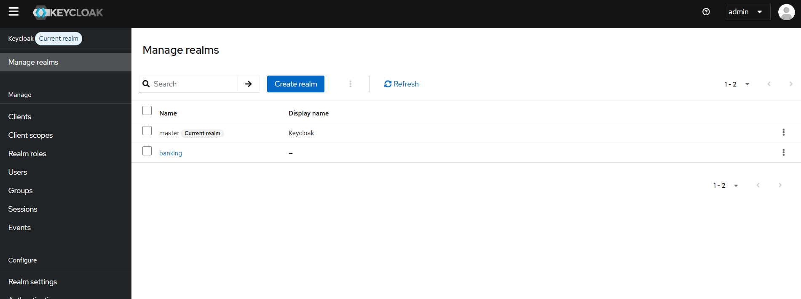
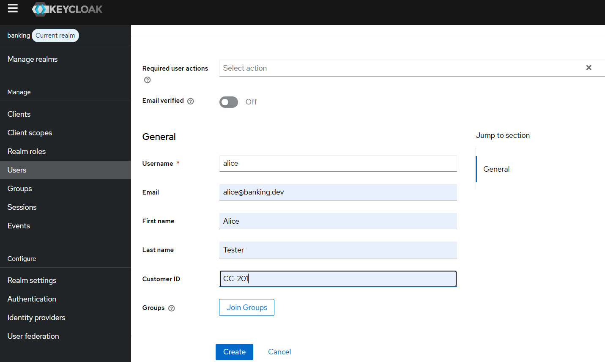
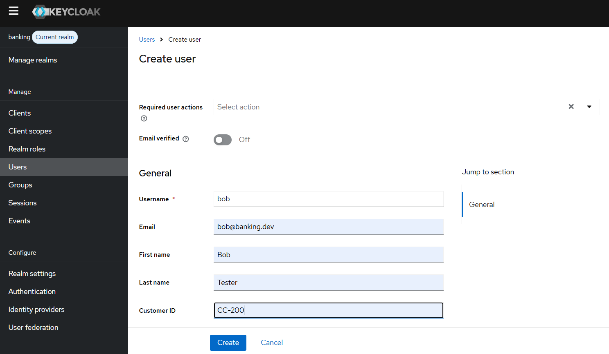
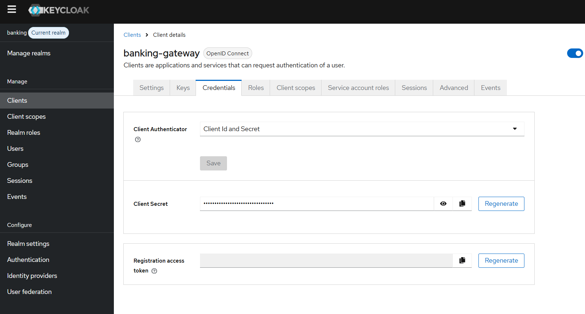

# Event-Driven Banking Case Study

## Prerequisites
 - JDK 21 
 - Maven 3.8+ 
 - Docker Desktop / Docker Engine

## Quick start

### Build the project
``
mvn clean install
``

### Run the infrastructure
First of all we need to create the docker network

```shell script
docker network create banking-net
```
Then we can start all the infrastructure services

```shell script
docker compose up -d
```
The next step is to run our microservices:

```shell script
mvn -pl anti-fraud-service spring-boot:run

mvn -pl bank-account-service spring-boot:run

mvn -pl bank-transfer-service spring-boot:run
```
Before we try to start a money transfer we need to install the debezium connectors.
Execute the following commands:

```shell script
curl -i -X POST http://localhost:8083/connectors  \
 -H "Content-Type: application/json"  --data-binary @./config/connect/transfer-outbox.json
  
curl -i -X POST http://localhost:8083/connectors  \
 -H "Content-Type: application/json" --data-binary @./config/connect/account-outbox.json
 
curl -i -X POST http://localhost:8083/connectors \
 -H "Content-Type: application/json" --data-binary @./config/connect/antifraud-outbox.json
```
and verify that the connectors are installed by executing:

```shell script
curl -s http://localhost:8083/connectors
```

You should see the following result:

```shell script
$ curl -s http://localhost:8083/connectors
["account-outbox","antifraud-outbox","transfer-outbox"]
```

### Create the bank customers to test

There are two predefined bank accounts inside the accounts database and each account is owned by one customer:
Account with id ACC-201 is owned by CC-200 customerId
Account with id ACC-101 is owned by CC-201 customerId

We need to create the Keycloak users that correspond to these customerIds:

Browse to http://localhost:8180 and sign in Keycloak with credentials 
```shell
username: admin
password: admin
```
Then navigate to Manage realms and click on banking realm to ensure that this is the current realm.



Now we are able to create the two users by navigating to Users > Add User and fill the users data as the next two pictures depict





### Setup the gateway

Again from Keycloak administration page, navigate to Clients > banking-gateway > Credentials and copy the Client Secret value.
Probably you will need to regenerate this secret for the first time you run the docker-compose.



Then execute the following commands to start the gateway

```
export KEYCLOAK_EXCHANGE_CLIENT_SECRET="<banking-gateway client secret>"
mvn -pl banking-gateway spring-boot:run
```

### Test the API

In order to test the transfer initiation you can run the ./config/tests/initiate-transfer.sh bash script by passing the banking-gateway CLIENT_SECRET as below: 

```shell
bash ./config/tests/initiate-transfer.sh <banking-gateway CLIENT_SECRET>
```
The above execution will print the transfer id, which you can use to call the other two endpoints as below:

```shell
echo "Cancel the transfer.."
bash ./config/tests/cancel-transfer.sh <banking-gateway CLIENT_SECRET> <transfer id>

echo "Get the transfer status.."
bash ./config/tests/get-transfer.sh <banking-gateway CLIENT_SECRET> <transfer id>
```

There is also the complete-cancel-contention.sh bash script that tests the contention happen between transfer completion and cancellation.
It accepts one parameter for the banking-gateway CLIENT_SECRET and other one for the delay in seconds between calling initiate and cancel transfer endpoints. 

For example, if we want to see what happens in the transfer state when we initiate a transfer and after 1 second we decide to cancel it we run the below:

```shell
bash complete-cancel-contention.sh <banking-gateway CLIENT_SECRET> 1
```


